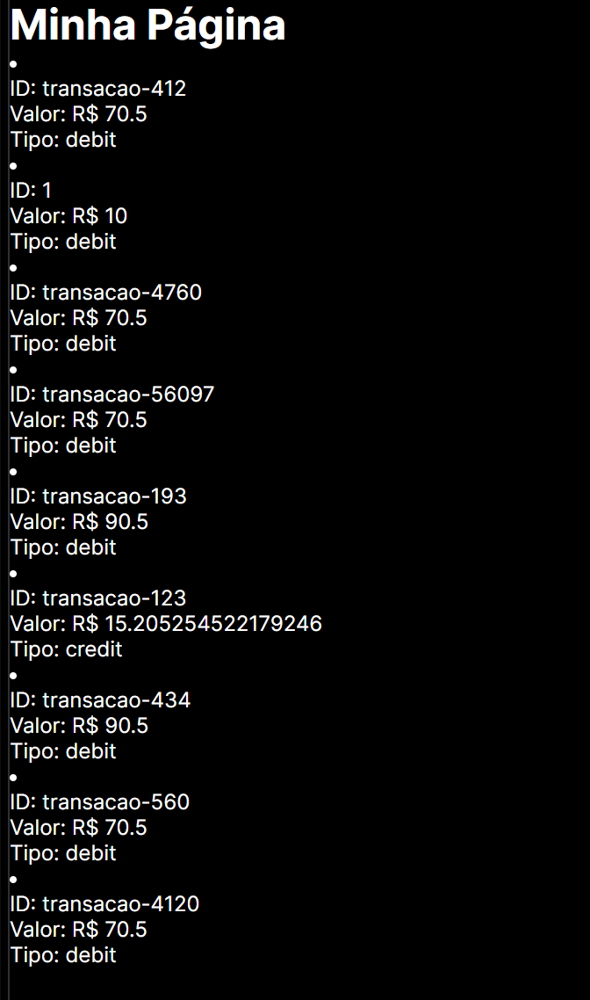

Descrição:

Este projeto implementa um sistema completo de fila SQS com API e front-end para processar mensagens.

Requisitos:

Ter o AWS CLI instalado e configurado com credenciais válidas.
Node.js instalado.
Setup:

1. Backend:

Abra o terminal no diretório convem-desafio.
Instale as dependências com npm install.
Configure as credenciais da AWS no arquivo utils/aws.js.
Inicie o servidor de fila SQS com node index.js.
Envie 100 mensagens para a fila com node post-api.
2. Frontend:

Abra o terminal no diretório convem-front-end.
Instale as dependências com npm install.
Inicie o servidor de desenvolvimento com npm run dev.

Funcionamento:

As mensagens são enviadas para a fila SQS através da API.
A API ativa um trigger no Lambda.
A função Lambda processa a mensagem e a adiciona ao DynamoDB.
O servidor SQS processa as mensagens em segundo plano.
O front-end exibe as mensagens processadas.

O resultado deve ser assim:
